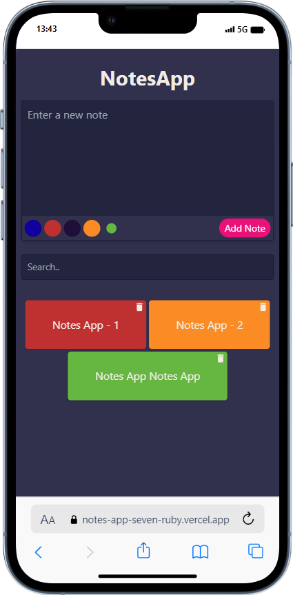
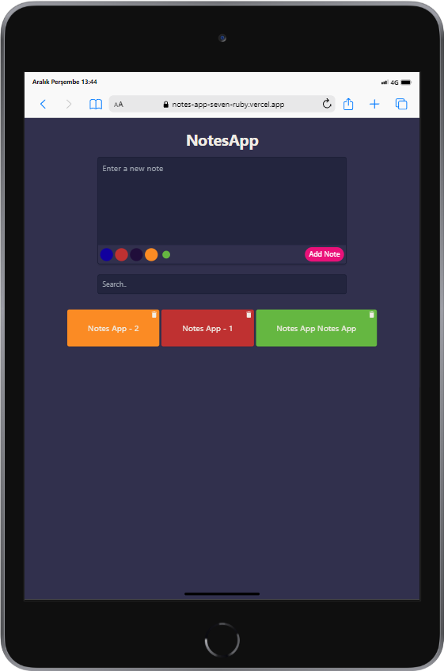
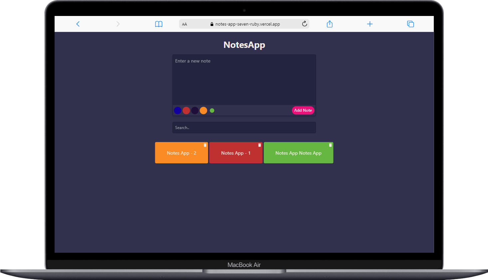

## Nodes App

Color the tasks you will do and add them to the system. Search through tasks and delete tasks if necessary.

## Live Demo

[https://notes-app-seven-ruby.vercel.app/](https://notes-app-seven-ruby.vercel.app/)

## Preview

<div align="center">
  
  
  
</div>

## Installation

#### Clone

```
https://github.com/gorkemuveyk/notes-app.git
```

#### Package Installation

```
npm i
```

#### Start

```
npm run dev
```
